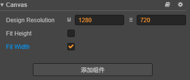
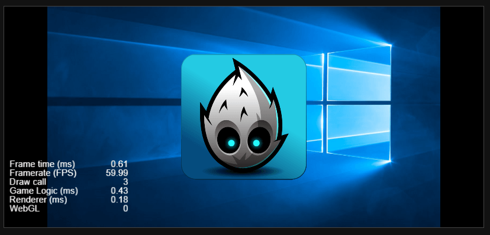
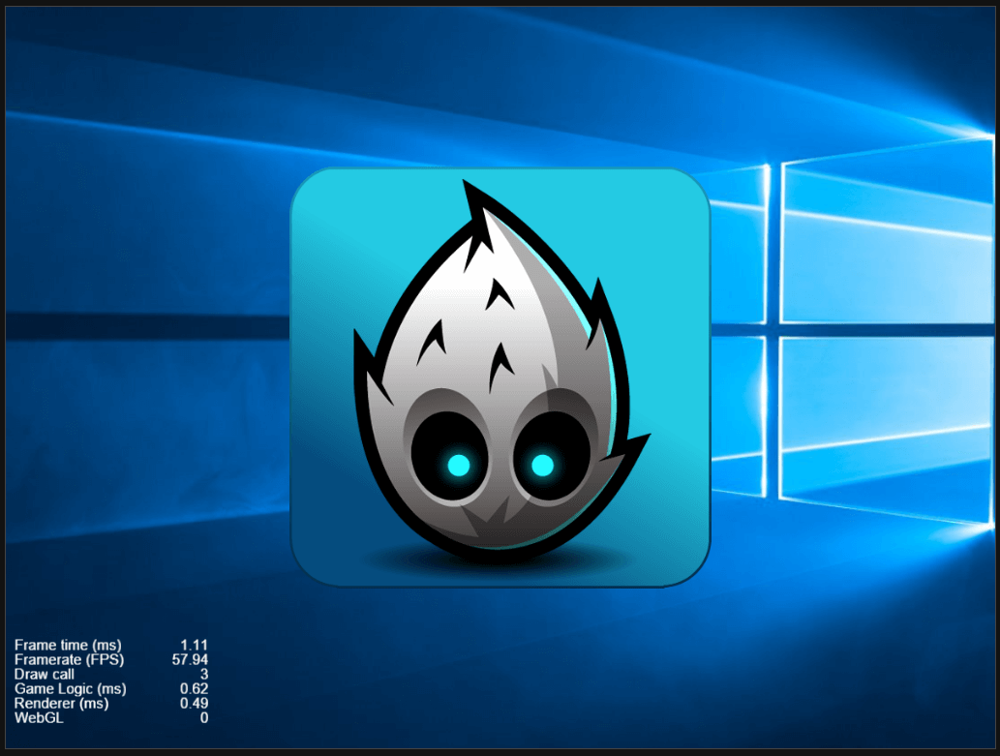
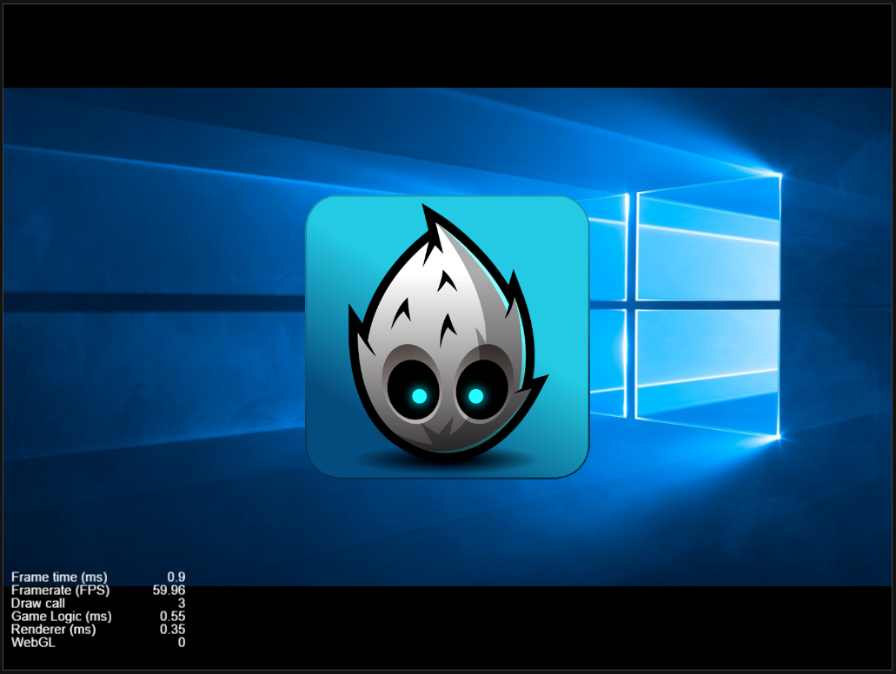

## CocosCreator屏幕适配

Creator的Canvas组件有FitHeight，FitWidth


假设设计分辨率为1280 / 720 = 1.7777
```markdown
1. 勾选FitHeihgt,FitWidth = cc.ContentStrategy.SHOW_ALL
2. 仅勾选FitHeight：heigth固定，拉伸width
3. 仅勾选FitWidth: width固定，拉伸height
```

## 设备宽高比>设计宽高比

例如IphoneX，宽高比=2688/1242=2.16，宽度较大
1. 勾选FitHeight：heigth固定，拉伸width
 - 最终width=720 * 2.16 = 1555，大于了设计图的width=1280
 - 如下图，左右留有黑边
 - 此时需要美术预留安全宽度，图片宽度多1555-1280=275

 
2. 勾选FitWidth：width固定，拉伸height
 - 最终height=1280 / 2.16 = 592
 - 此时周围没有黑边，完美适配
 

3. 因此当设备宽高比较大时，使用FitWidth是比较合适的

## 设备宽高比<设计宽高比

例如iPad，宽高比=2732/2048=1.33，高度较大
1. 勾选FitHeight：heigth固定，拉伸width
 - 最终width=720 * 1.33 = 957，小于设计宽度
 - 此时周围没有黑边，完美适配

 
2. 勾选FitWidth：width固定，拉伸height
 - 最终height=1280 / 1.33 = 962
 - 如下图，上下留有黑边
 - 此时需要美术预留安全高度，图片高度多1280-962=318
 

3. 因此当设备宽高比较小时，使用FitHeight是比较合适的

## 结论
1. 如果不想程序代码处理，为了背景能正常适配不拉伸不留黑边，需要美术预留安全区域
2. 如果改动美术比较麻烦，程序做完美适配的话，需要给cc.Canvas节点增加代码，动态处理适配

``` typescript
let canvas = this.node.getComponent(cc.Canvas);
let deviceW = cc.winSize.width;
let deviceH = cc.winSize.height;
let designW = cc.view.getDesignResolutionSize().width;
let designh = cc.view.getDesignResolutionSize().width;

let ratio1 = deviceW / deviceH;
let ratio2 = designW / designh;
// 设备宽高比较大时用fitWidth，较小时用fitHeight
canvas.fitWidth = ratio1 > ratio2;
canvas.fitHeight = !(ratio1 > ratio2);
```